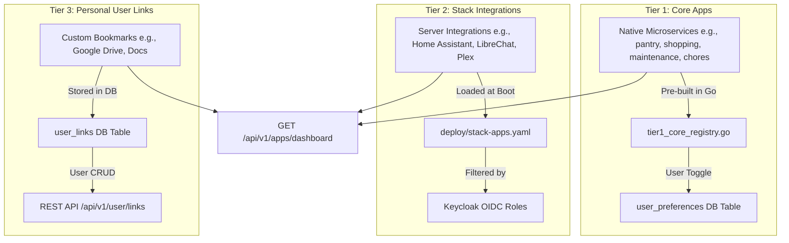

# Alfheim OS Dashboard Micro-Service (`apps/dashboard`)

The Dashboard is the central control plane, authentication entrypoint, and telemetry interface for the `alfheim` platform. It comprises a Go control plane backend and a React/Next.js frontend.

---

## 🏛️ 3-Tier Application & Link Architecture

The platform organizes applications, portals, and bookmarks into three distinct architectural tiers:



1. **Tier 1 (Core Apps):**
   - Pre-defined natively in Go backend code ([`tier1_core_registry.go`](file:///Users/leifkroeger/Dev/loeger-os/apps/dashboard/backend/internal/features/apps/tier1_core_registry.go)).
   - Visible to all authenticated users by default.
   - Users can hide/show specific Core Apps in their personal settings modal, stored in PostgreSQL `user_preferences`.

2. **Tier 2 (Stack Apps / Integrations):**
   - Configured via server-level YAML file ([`deploy/stack-apps.yaml`](file:///Users/leifkroeger/Dev/loeger-os/deploy/stack-apps.yaml)).
   - Loaded into memory at backend startup.
   - Filtered dynamically based on Keycloak OIDC roles (`required_roles`).
   - Read-only for standard users (managed via server deployment config).

3. **Tier 3 (User Links):**
   - Stored in PostgreSQL `user_links` table linked to `user_id` (Keycloak `sub`).
   - Fully CRUD-capable per user (`GET/POST/PUT/DELETE /api/v1/user/links`).

---

## 🏗️ Architecture & Network Communication (Caddy Gateway)

The frontend and backend services run in isolated Docker containers, coordinated by Caddy as the central ingress reverse proxy:

```mermaid
graph TD
    Client[Web Browser Client] -->|Frontend Host: alfheim.loegien.localhost| Caddy[Caddy Reverse Proxy]
    Client -->|API Host: api.alfheim.loegien.localhost| Caddy
    Caddy -->|/api/v1/apps| GoBackend[Go Backend Control Plane :8080]
    Caddy -->|/ (Fallback)| NextFrontend[Next.js Frontend :3000]
    GoBackend -->|SQL| Postgres[(PostgreSQL DB)]
    GoBackend -->|OIDC Token Validation| Keycloak[Keycloak OIDC]
```

### Routing Rules (Ingress vs. Application)
- **Ingress Gateway (Caddy)**: Routes domain requests across `alfheim.loegien.localhost` (frontends) and `api.alfheim.loegien.localhost` (backends). Routes Go backend endpoints (`/api/v1/apps`, `/api/v1/user/preferences`, `/api/v1/user/links`, `/profile`, `/households`, `/telemetry`) to `dashboard-backend:8080`.
- **Application Page Routing (Next.js)**: Handles all internal route paths (`/`, `/household`, `/profile`, `/settings`).

---

## 📦 Monorepo Separation of Concerns & FDD

### 1. `@alfheim/shared` UI Library (Workspace Package)
- Located in [`packages/shared/`](file:///Users/leifkroeger/Dev/loeger-os/packages/shared).
- Statically agnostic UI widgets (`Sidebar`, `Header`, `BottomNavBar`), localization, and presentation components.

### 2. Core Engine Layer (`apps/dashboard/frontend/src/core/`)
- Global core logic such as centralized HTTP `ky` instance [`client.ts`](file:///Users/leifkroeger/Dev/loeger-os/apps/dashboard/frontend/src/core/api/client.ts) and state providers.

### 3. Local Feature Modules (`apps/dashboard/frontend/src/features/`)
- Business capability folders (`apps`, `household`, `contact`, `profile`).
- Strict FDD boundaries; feature modules export clean contracts via barrel `index.ts`.

---

## 🎨 Stacking Contexts & Z-Index Layer Standards

- **Map Isolation**: Wrap map elements in parent containers using `relative z-0 isolate overflow-hidden`.
- **Modal Backdrops**: All full-screen overlays use `z-[9999]` and fixed positioning.

---

## 📑 System Documentation

For detailed analysis and specifications, please refer to:
- [Go Backend Architecture README](file:///Users/leifkroeger/Dev/loeger-os/apps/dashboard/backend/README.md)
- [React/Next.js Frontend Architecture README](file:///Users/leifkroeger/Dev/loeger-os/apps/dashboard/frontend/README.md)
