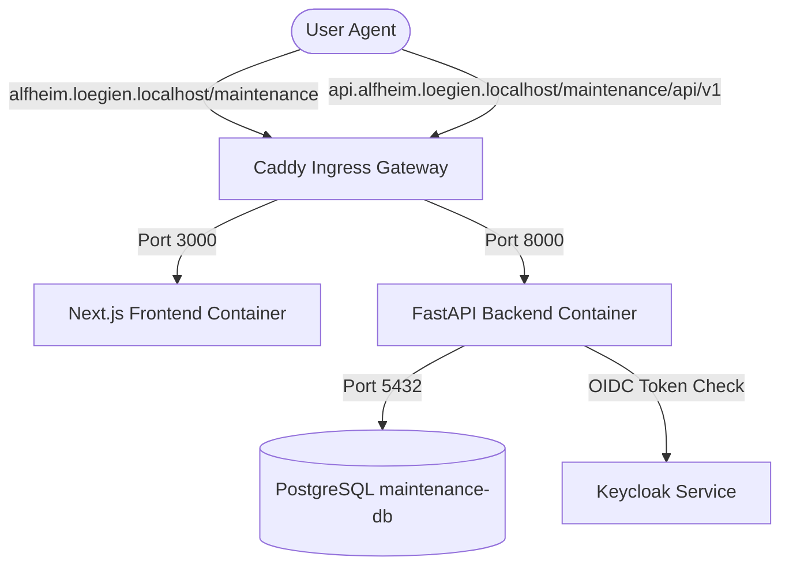

# Maintenance App Architecture — WHY (`apps/maintenance/`)

This directory houses the **Maintenance & Device Inventory Service** for the `alfheim` monorepo. It manages the registration of household devices, coordinates recurring maintenance schedules, runs interactive guided maintenance checklists, and tracks historical service events.

---

## 🛠️ System Overview & Architecture

The application is split into two major FDD-structured tiers served through the Caddy gateway proxy:



### 1. Ingress Mapping (Caddy Gateway)
* **Frontend**: Mapped to frontend host domain under subpath `http://alfheim.loegien.localhost/maintenance`.
* **Backend**: Mapped to API gateway domain under `http://api.alfheim.loegien.localhost/maintenance/api/v1`. Caddy strips the `/maintenance` prefix via `handle_path` and forwards `/api/v1/...` to the FastAPI backend.

### 2. Dependency Services
* **Database**: Runs on PostgreSQL (`maintenance-db`). Managed using SQLModel (SQLAlchemy) async sessions.
* **Authentication**: Integrates with Keycloak OIDC. Bearer JWT tokens are validated via the `get_current_user_and_household` dependency injected into FastAPI endpoints.

---

## 🚀 Getting Started

To spin up the Maintenance App along with its dependencies locally:

```bash
# Start Keycloak and Ingress infrastructure
./infrastructure/up.sh

# Start the maintenance database, backend, and frontend containers
./scripts/up.sh maintenance
```
