# Pantry Backend — How the API Works

> **This README answers HOW the backend is implemented.** For the business rationale, see the [app-level README](../README.md). For the frontend implementation, see [`../frontend/README.md`](../frontend/README.md).

---

## REST API Endpoints (v1)

| Method | Path | Description |
| :--- | :--- | :--- |
| `GET` | `/api/v1/products` | List all products (global + household) |
| `POST` | `/api/v1/products` | Create a new product blueprint |
| `GET` | `/api/v1/products/search?q=` | Full-text search products |
| `GET` | `/api/v1/products/barcode/{code}` | Lookup product by EAN/UPC barcode |
| `GET` | `/api/v1/categories` | List all categories |
| `POST` | `/api/v1/categories` | Create a new category |
| `GET` | `/api/v1/locations` | List all storage locations |
| `POST` | `/api/v1/locations` | Provision a new location |
| `GET` | `/api/v1/inventory/state` | Current stock state (live cache) |
| `GET` | `/api/v1/inventory/ledger` | Immutable transaction audit log |
| `POST` | `/api/v1/inventory/transactions` | Record a new IN/OUT/WASTE transaction |
| `GET` | `/api/v1/inventory/low-stock` | Products below minimum stock quota |
| `GET` | `/api/v1/inventory/expiration` | Expired + valid batches summary |

---

# Digital Pantry Backend

This directory houses the backend microservice for the `loeger-os` Digital Pantry application. Built with FastAPI, SQLModel (SQLAlchemy), and FastMCP, the service acts as a multi-tenant pantry inventory manager that exposes standard REST API endpoints for user interfaces alongside a Model Context Protocol (MCP) server layer for integration with AI/LLM clients.

---

## 1. Directory Structure & Architecture

The application is structured around **Feature-Driven Design (FDD)** principles, keeping database models, business logic (services), routers, seeders, tests, and AI tools self-contained in domain directories under `src/features/`.

```
backend/
├── compose.yml                 # Runs PostgreSQL for local development
├── pyproject.toml              # Dependencies (fastapi, fastmcp, sqlmodel, pint)
├── README.md                   # This documentation
├── src/
│   ├── main.py                 # Application entry point (FastAPI + lifespan)
│   ├── core/                   # Shared system utilities & setup
│   │   ├── config.py           # Environment variables (Pydantic Settings)
│   │   ├── database.py         # SQLAlchemy engine, session maker, DB init
│   │   ├── dependencies.py     # Auth context dependency injectors
│   │   └── telemetry.py        # OpenTelemetry instrumentations
│   ├── mcp/                    # MCP server core
│   │   └── server.py           # Central FastMCP server and tool discovery engine
│   └── features/               # Independent feature domains
│       ├── locations/          # Storage places (Cabinet, Fridge, Pantry)
│       ├── categories/         # Product classification tags (Grains, Drinks)
│       ├── products/           # Product blueprints (barcode, brand, name)
│       └── inventory/          # Stock ledgers, state cache, units, expiration
```

---

## 2. System Architecture Graph

This diagram shows how entry points (FastAPI / FastMCP Hub) interact with the core engine and the feature domains, illustrating key model-to-model relations and code dependencies:

```mermaid
graph TD
    subgraph entrypoints [Entry Points]
        main["src/main.py (FastAPI App)"]
    end

    subgraph mcp_layer [MCP Server Layer]
        mcp_server["src/mcp/server.py (FastMCP Hub)"]
        loc_mcp["src/features/locations/mcp_tools.py"]
        cat_mcp["src/features/categories/mcp_tools.py"]
        prod_mcp["src/features/products/mcp_tools.py"]
        inv_mcp["src/features/inventory/mcp_tools.py"]
    end

    subgraph core [Core Engine]
        db["src/core/database.py (SQLAlchemy Pool)"]
        config["src/core/config.py (Pydantic Settings)"]
        deps["src/core/dependencies.py (Auth/Context)"]
        telemetry["src/core/telemetry.py (OpenTelemetry)"]
    end

    subgraph features [Feature Domains]
        subgraph locations_domain [Locations Feature]
            loc_router["src/features/locations/router.py"]
            loc_service["src/features/locations/service.py"]
            loc_models["src/features/locations/models.py"]
            loc_seeder["src/features/locations/seeder.py"]
        end

        subgraph categories_domain [Categories Feature]
            cat_router["src/features/categories/router.py"]
            cat_service["src/features/categories/service.py"]
            cat_models["src/features/categories/models.py"]
            cat_seeder["src/features/categories/seeder.py"]
        end

        subgraph products_domain [Products Feature]
            prod_router["src/features/products/router.py"]
            prod_service["src/features/products/service.py"]
            prod_models["src/features/products/models.py"]
            prod_schemas["src/features/products/schemas.py"]
            prod_seeder["src/features/products/seeder.py"]
            off_client["src/features/products/clients/open_food_facts.py"]
        end

        subgraph inventory_domain [Inventory Feature]
            inv_router["src/features/inventory/router.py"]
            inv_service["src/features/inventory/service.py"]
            inv_models["src/features/inventory/models.py"]
            inv_schemas["src/features/inventory/schemas.py"]
            inv_seeder["src/features/inventory/seeder.py"]
            inv_units["src/features/inventory/units.py"]
            inv_exc["src/features/inventory/exceptions.py"]
        end
    end

    %% Router to Service Dependencies
    main --> loc_router
    main --> cat_router
    main --> prod_router
    main --> inv_router
    
    loc_router --> loc_service
    cat_router --> cat_service
    prod_router --> prod_service
    inv_router --> inv_service

    %% Service dependencies
    prod_service --> off_client
    inv_service --> inv_units
    inv_service --> inv_exc

    %% Cross-feature models/services
    prod_service -.-> |Category Validation| cat_models
    inv_service -.-> |Product Verification| prod_models
    inv_service -.-> |Location Verification| loc_models

    %% Core dependencies
    features --> db
    features --> deps
    main --> config
    main --> telemetry

    %% MCP mappings
    main --> mcp_server
    mcp_server -.-> |Dynamic Discovery| loc_mcp
    mcp_server -.-> |Dynamic Discovery| cat_mcp
    mcp_server -.-> |Dynamic Discovery| prod_mcp
    mcp_server -.-> |Dynamic Discovery| inv_mcp

    loc_mcp --> loc_service
    cat_mcp --> cat_service
    prod_mcp --> prod_service
    inv_mcp --> inv_service
```



---

## 3. Module & File Breakdown

### 3.1 Core Utilities (`src/core/`)
*   [config.py](file:///Users/leifkroeger/Dev/loeger-os/apps/pantry/backend/src/core/config.py): Employs `pydantic-settings` to configure database credentials, telemetry variables, and debug settings loaded from `.env` files.
*   [database.py](file:///Users/leifkroeger/Dev/loeger-os/apps/pantry/backend/src/core/database.py): Establishes the asynchronous SQLAlchemy engine, the connection pool (`async_session_factory`), and the `init_db` logic that registers tables on startup.
*   [dependencies.py](file:///Users/leifkroeger/Dev/loeger-os/apps/pantry/backend/src/core/dependencies.py): Houses `UserHomeContext` and dependencies mock-injecting user authorization contexts (`MOCK_USER_ID`, `MOCK_HOME_ID`). In production, this layer will parse JWT cookies or headers.
*   [telemetry.py](file:///Users/leifkroeger/Dev/loeger-os/apps/pantry/backend/src/core/telemetry.py): Initializes OpenTelemetry hooks, collecting logs, traces, and metrics from FastAPI and SQLAlchemy, routing them to the OTLP Collector.

### 3.2 Features (`src/features/`)
*   **Locations**: Storage places for commodities. Ensures standard system fallbacks (like `Backlog`) cannot be renamed or deleted. Deleting a custom location transparently reassigns stored stock to `Backlog`.
*   **Categories**: Custom tag groups for products. Enforces name uniqueness within the same home space or globally.
*   **Products**: Product blueprints (Stammdaten) detailing the name, brand, barcode, base unit, and nutrition details.
    *   *Barcode Promotion*: To prevent conflicts across homes, any product created/updated with a valid EAN/UPC barcode is promoted to global (`is_global = True`, `home_id = None`), allowing all homes to share the blueprint.
    *   *Open Food Facts Client*: Ingests raw brand and nutrition metadata on a cache miss when a barcode is searched.
*   **Inventory**: Stock control ledger and current stock cache.
    *   *Immutable Ledger*: Every transaction (IN, OUT, WASTE, RECONCILIATION) is logged as a permanent record.
    *   *Unit Normalization*: Uses `Pint` to convert any compatible user unit (e.g. `kg`, `pack`) into the product's base unit (e.g. `g`, `piece`) before database commit.
    *   *ACID Safety*: Acquires write-locks (`SELECT FOR UPDATE`) on consolidated cache rows to prevent write races.

### 3.3 FastMCP AI Hub (`src/mcp/`)
*   [server.py](file:///Users/leifkroeger/Dev/loeger-os/apps/pantry/backend/src/mcp/server.py): Defines the `FastMCP` server instance and houses the dynamic loader `discover_and_import_mcp_tools`.
*   **Dynamic Discovery**: To keep feature domains decoupled (Open-Closed Principle), any file named `mcp_tools.py` under the `src/features/` folder is auto-imported at startup, dynamically mounting its tools onto the central FastMCP hub.

---

## 4. Multi-Tenancy & Isolation Model

Multi-tenancy boundaries are strictly enforced throughout database queries to prevent cross-home data leaks:
1.  **Metadata Visibility**: Products and Categories are visible to a home if they are system-wide (`is_global = True`) OR owned by the home (`home_id == home_id`).
2.  **Stock & Ledger Boundaries**: Since physical inventory states and ledger transactions belong to physical locations, and locations belong to a home space (`Location.home_id == home_id`), all inventory queries join the `Location` table and filter by `Location.home_id == home_id`. This prevents homes from inspecting other homes' stock levels or transaction details.
3.  **CRUD Protections**: Modifications (updates/deletions) check ownership boundaries and raise errors when clients attempt to modify global resources.

---

## 5. Development & Running

### 5.1 Prerequisite Services
Start the PostgreSQL container using Docker Compose:
```bash
docker compose up -d
```

### 5.2 Local Server Setup
1. Copy the environment template:
   ```bash
   cp .env.example .env
   ```
2. Setup and activate virtual environment via `uv`:
   ```bash
   uv venv
   source .venv/bin/activate
   ```
3. Sync python packages:
   ```bash
   uv sync
   ```
4. Start the development server (runs FastAPI on port `8000` and mounts FastMCP HTTP/SSE server on `/mcp`):
   ```bash
   uv run uvicorn src.main:app --reload
   ```

### 5.3 Testing

Pantry uses Pytest alongside HTTPX ASGITransport for asynchronous test cases. Tests are co-located within feature directories in accordance with FDD principles, split into unit tests (verifying services, unit conversions, and schemas in isolation) and integration tests (verifying API routing and serialization logic).

#### Running backend tests from the parent folder:
You can run all tests and get a coverage report directly from the `pantry/` root folder:
```bash
./run-tests.sh
```

#### Running backend tests from the `backend/` folder:
```bash
# Run pytest with code coverage tracking
uv run pytest --cov=src src/

# Run a specific feature's tests
uv run pytest src/features/products/tests/
```

