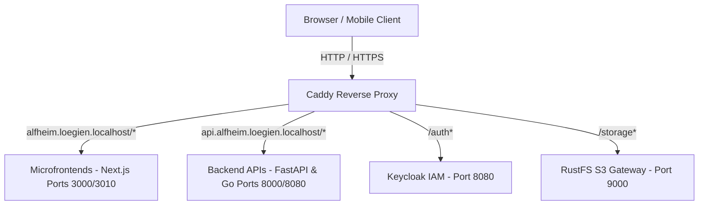

# Caddy Reverse Proxy & API Gateway (`infrastructure/caddy/`)

The `infrastructure/caddy` module provides the central entry-point reverse proxy and API gateway for the Alfheim monorepo. It manages MFE subpath routing, API gateway mapping, locale redirects, CORS handling, and SSL/TLS termination.

---

## 🎯 Purpose & Architecture

Caddy serves as the unified routing layer for all microservices, microfrontends (MFEs), and shared platform tools:



---

## 🌐 Ingress Routing Rules

### 1. MFE Base Path Proxies (`alfheim.loegien.localhost` & `alfheim.loegien.de`)
- Base path redirects: e.g. `/pantry` -> `/pantry/en`, `/chores` -> `/chores/de`, `/budget` -> `/budget/en`.
- Microfrontend routes:
  - `/pantry*` -> `pantry-frontend:3000`
  - `/shopping*` -> `shopping-frontend:3010`
  - `/maintenance*` -> `maintenance-frontend:3000`
  - `/chores*` -> `chores-frontend:3000`
  - `/library*` -> `library-frontend:3000`
  - `/budget*` -> `budget-frontend:3000`
  - `/workout*` -> `workout-frontend:3000`
  - `/chat*` -> `chat-frontend:3000`
  - `/` (Catch-all) -> `dashboard-frontend:3000`

### 2. Central API Gateway (`api.alfheim.loegien.localhost` & `api.alfheim.loegien.de`)
- Preflight CORS handler for `GET, POST, PUT, PATCH, DELETE, OPTIONS` requests.
- Authorization header and `X-Household-ID` propagation.
- Service endpoints:
  - `/auth*` -> `keycloak:8080` (Native subpath, no path stripping)
  - `/storage*` -> `rustfs:9000` (S3 object storage endpoint & presigned URLs)
  - Backend API proxies (FastAPI / Go microservices).

---

## ⚙️ Exposed Ports & Network

- **Ports**: `80:80` (HTTP), `443:443` (HTTPS)
- **Docker Network**: `gateway-net` (External bridge network)

---

## 🚀 Execution & Management

Caddy is managed via Docker Compose:

```bash
# Start Caddy ingress proxy
docker compose -f infrastructure/caddy/compose.yml up -d

# Reload configuration without downtime
docker compose -f infrastructure/caddy/compose.yml exec caddy caddy reload --config /etc/caddy/Caddyfile

# View access logs
docker compose -f infrastructure/caddy/compose.yml logs -f caddy
```
